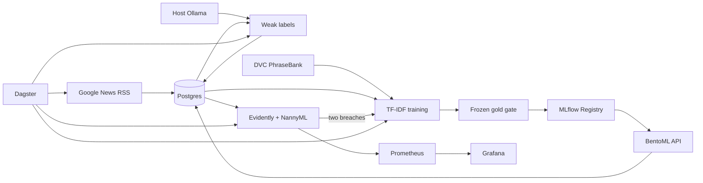

# finance-mlops

A local, end-to-end MLOps loop for three-class financial-news sentiment. The model is intentionally simple; ingestion, lineage, orchestration, serving, monitoring, promotion, and retraining are the deliverable.



## Start

Requirements: Docker Compose, 25GB free disk, and `data/phrasebank/`. Restore the DVC-versioned dataset after starting MinIO if it is absent:

```bash
docker compose up -d minio createbuckets
uv sync --dev
AWS_ACCESS_KEY_ID=${MINIO_ROOT_USER:-minioadmin} \
AWS_SECRET_ACCESS_KEY=${MINIO_ROOT_PASSWORD:-minioadmin} uv run dvc pull
docker compose up -d --build
```

The final command starts the full stack and bootstraps `finance-sentiment@champion` if the registry is empty. All exposed ports bind to localhost.

| Service | URL | Credentials |
|---|---|---|
| Grafana | http://localhost:3003 | `admin` / `admin` |
| BentoML API | http://localhost:3004 | none, local only |
| Dagster | http://localhost:3002 | none, local only |
| MLflow | http://localhost:5000 | none, local only |
| MinIO | http://localhost:9001 | `minioadmin` / `minioadmin` |
| Prometheus | http://localhost:9090 | none, local only |

Override development credentials through a gitignored `.env`. Do not expose this stack to a network without authentication and real secrets.

## Five-minute demo

```bash
./scripts/demo
./scripts/smoke
```

Example request:

```bash
curl -H 'Content-Type: application/json' \
  -d '{"headlines":["Company profits beat forecasts"]}' \
  http://localhost:3004/predict
```

The response contains the class, confidence, all class probabilities, and active MLflow model version. Predictions are retained in Postgres for monitoring.

## Automated loop

Dagster defines these local schedules:

- RSS ingestion hourly
- weak labeling daily at 02:00
- monitoring hourly at `:30`
- TF-IDF challenger training Sundays at 03:00
- additional retraining after two consecutive monitoring breaches

Weak labels require host Ollama and `qwen3:14b`:

```bash
ollama pull qwen3:14b
sudo systemctl stop ollama
OLLAMA_HOST=172.17.0.1:11434 ollama serve
```

This binds Ollama to Docker's host bridge instead of the LAN; use your actual `docker0` address if it differs. If Ollama is unavailable, the daily labeling asset skips without breaking the other schedules.

Retraining combines PhraseBank training rows with three-class weak labels having confidence at least `0.8`, excludes frozen `AllAgree` evaluation rows, and waits for 200 new eligible labels. A challenger becomes `@champion` only when macro-F1 does not regress and bearish F1 is at least `0.525`. BentoML detects the alias change and atomically reloads it.

Evidently measures headline-length and prediction-distribution drift. NannyML estimates multiclass accuracy from stored probabilities. Prometheus receives serving and pipeline metrics; Grafana provisions the `Finance MLOps` dashboard.

## Optional FinBERT run

The guaranteed automated path is TF-IDF. On the available CUDA GPU, run the pinned FinBERT experiment manually:

```bash
uv run --extra finetune python -m finance_mlops.finetune
```

It registers `@challenger`; automated TF-IDF retraining remains the cheap scheduled path.

## Development

```bash
uv sync --all-extras --dev
./scripts/check
uv run pytest
```

Manual modules remain available:

```bash
uv run --extra ingest python -m finance_mlops.ingest
uv run --extra label --extra ingest python -m finance_mlops.label
uv run --extra baseline python -m finance_mlops.baseline
uv run --extra baseline --extra ingest python -m finance_mlops.retrain
uv run --extra monitor --extra baseline python -m finance_mlops.monitor
```

Configuration uses environment variables: `DATABASE_URL`, `MLFLOW_TRACKING_URI`, `PHRASEBANK_DIR`, `OLLAMA_HOST`, `WEAK_LABEL_MODEL`, `MIN_WEAK_LABEL_CONFIDENCE`, `MIN_NEW_WEAK_LABELS`, monitoring thresholds, and service credentials.

## Scope

This finished local v1 deliberately excludes Kubernetes/Argo CD, Label Studio, ONNX, an end-user UI, cloud deployment, and production authentication. `design.md` retains those as possible follow-ups, not required functionality.
