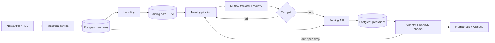

# Financial News Sentiment Classifier — Design Document

A self-hosted, end-to-end MLOps project. A small model classifies financial news
headlines as bullish / bearish / neutral per ticker. The model is deliberately
simple; the **operations loop around it is the real deliverable**.

---

## 1. Goals & constraints

- **Primary goal:** demonstrate and learn production MLOps — tracking, versioning,
  orchestration, serving, monitoring, eval gates, automated retraining.
- **Secondary goal:** a genuinely useful personal tool (sentiment on your own
  holdings), kept as decision-support, never an auto-trader.
- **Hard constraint — local & self-hosted:** everything runs on your own
  hardware. The *only* unavoidable external dependency is the news source itself
  (you cannot self-host a live newswire), and even that is swappable.
- **Learning bias:** favour tools you have *not* used much (DVC, an ML
  orchestrator, Evidently, Label Studio, MinIO, BentoML) over re-treading
  things already on your CV.
- **Modern stack:** lean into a current 2026 toolchain (uv, Ruff, Polars,
  MLflow 3.x, Dagster, BentoML, Evidently + NannyML) to signal currency — but
  modern *and recognised*, not bleeding-edge-obscure. Keep the stable core
  (Postgres, Docker, Kubernetes, Grafana) deliberately boring and spend the
  "modern" budget on the data/ML-specific layer where it actually reads as
  cutting-edge.

### Guiding principles

1. **Boring model, rich ops.** Start with a model so simple it gets out of the
   way, so all effort goes into the machinery.
2. **Build the platform first, upgrade the model through it later.** The fine-tune
   should slot into an existing pipeline without rewiring it.
3. **Make drift real.** A continuously arriving, drifting news stream is what
   makes monitoring and retraining meaningful rather than staged.
4. **Modern where it shows.** A current toolchain is a cheap, loud signal of
   being up to date — concentrate it on the Python/ML layer (uv, Polars,
   Dagster, MLflow 3.x), not on reinventing infrastructure.

---

## 2. Architecture sketch



Everything in that diagram runs in your own containers. News in at the left,
predictions and dashboards out at the right, a retraining loop closing back on
the training pipeline.

---

## 3. Stages & the decisions at each

Each stage lists the decisions you actually have to make. Where it helps, there's
a light lean — but these are yours to settle.

> **Tooling baseline (applies across every stage).** Use **uv** for packaging and
> environments, **Ruff** for lint + format, and **Polars** as the default dataframe
> (fall back to Pandas only where a library demands it). These three are the
> cheapest, loudest "modern engineer" signal and none are currently on your CV.

### Stage 0 — Scope & problem definition

- **Ticker universe.** Everything, or just your Trading212 holdings + a couple of
  indices? *Lean: small universe first; expand later.*
- **Label schema.** 3-class (bullish / bearish / neutral) is the standard. Decide
  whether "neutral" includes "irrelevant" or is its own bucket.
- **Unit of classification.** Headline only, or headline + summary, or full body?
  *Lean: headline + short summary — cheap, and most feeds give you both.*
- **Per-document vs per-ticker sentiment.** A headline can mention several tickers
  with opposite sentiment. Decide whether you tackle aspect-level sentiment now or
  defer it. *Lean: defer; one label per document to start.*
- **Success metric.** Macro-F1 (classes will be imbalanced) as the headline
  number; decide your minimum bar.
- **Benchmark to beat.** Off-the-shelf FinBERT, or a lexicon baseline. You need
  something to measure "did fine-tuning actually help".

#### Settled (2026-06-17)

| Decision | Resolution |
|---|---|
| **Ticker universe** | Small hand-curated `tickers.txt` (settled in Stage 1). |
| **Sentiment grain** | **Document-level, ticker-blind model.** The `ticker` on a row is *which feed surfaced the headline*, not an aspect target — same headline under two tickers gets the same label. Aspect-level sentiment deferred. Per-ticker storage earns its keep for joining to holdings (Stage 12), **not** differential sentiment. |
| **Label schema** | **4-class: bullish / bearish / neutral / irrelevant.** `irrelevant` = document-level *non-financial* text (consistent with the ticker-blind model) — a feed-quality signal, not per-ticker off-target. **Single** classifier, not a two-stage relevance gate. |
| **Cold start** | Day-one baseline trains on **PhraseBank only** (`75Agree \ AllAgree`, 3-class — bull/bear/neutral). FiQA and the injected-`irrelevant` seed (AG News) both **dropped** (see Stage 2 rationale): tweet/aspect skew and a wrong-distribution `irrelevant` class aren't worth wiring into a throwaway model. The baseline is **3-class**; `irrelevant` enters only once Ollama weak-labels accumulate from live RSS, where its true distribution lives. Consequence to track: model output contract goes 3→4 class at Stage 4/7 (a serving version bump, not a retrain). |
| **Unit of classification** | **Headline only.** Matches the single-sentence corpus grain, never null (`headline NOT NULL`), no train/serve skew. `summary` is still stored — revisit for the Stage 4 fine-tune where longer context helps. |
| **Success metric** | Headline number = **macro-F1 over all 4 classes**. Honest gate metric = **macro-F1 over the 3 sentiment classes**, measured on the Stage 2 gold set (not the corpus). Bar = **beat the benchmark + a `bearish`-F1 floor**; exact numbers filled once the gold set exists. (`irrelevant` is the easy class — kept out of the gate metric so it can't pad the average.) |
| **Benchmark** | **Off-the-shelf FinBERT** (3 sentiment classes, on the eval anchor) as the external reference-to-beat — and it **doubles as the Stage 4 base model**, so "beat off-the-shelf FinBERT" directly measures whether fine-tuning helped. Internal baseline = Stage 3 TF-IDF + logreg (the floor Stage 4 must clear). No lexicon floor. (FNSPID rejected as a training source: binary labels, FinBERT-generated → circular against this benchmark.) |

### Stage 1 — Data ingestion

- **Source(s).** See the tools section. Decide primary + fallback.
- **Pull mode.** Polling on a schedule vs WebSocket streaming. *Lean: start with
  scheduled polling; it's simpler and your retraining cadence doesn't need
  sub-second news.*
- **Storage.** A relational store (Postgres) for news + predictions is plenty.
  Decide your schema: id, source, timestamp, ticker(s), headline, summary, url,
  ingested_at.
- **Deduplication.** The same story appears across many outlets. Decide a dedup
  strategy (URL, title hash, fuzzy match).
- **History vs live.** Backfill historical news for a richer first training set,
  or start fresh and accumulate? *Lean: a modest backfill so you can train on day
  one, then accumulate.*

#### Settled (2026-06-17)

| Decision | Resolution |
|---|---|
| **Ticker universe** | Small hand-curated `tickers.txt`, one symbol/line, `#` comments. No DB table for the watchlist. |
| **Source** | **RSS-only** (per-ticker Yahoo / Google News feeds). No API keys/accounts. Finnhub is a documented future swap-in (for summaries/backfill) — not built now. |
| **Cold start** | Day-one baseline trains on **PhraseBank only** (`75Agree \ AllAgree`, 3-class — see Stage 0/2). Live RSS accumulates for weak-labelling, drift + retraining, and is where the `irrelevant` class is first learned. |
| **Pull mode** | **Polling** (RSS forces it). **Hourly**, via plain cron / sleep-loop now; Dagster takes over at Stage 6 without touching ingest code. |
| **Row grain** | **One row per (article × ticker)**. Same story in two feeds = two rows. Matches per-ticker sentiment grain; no arrays/join table. |
| **Dedup** | `UNIQUE dedup_key = sha256(ticker + normalized_title)`, `ON CONFLICT DO NOTHING`. Robust to Google News URL noise. Cross-outlet fuzzy dedup deferred. |
| **Storage** | Postgres `news` table (below). `summary`/`url`/`published_at` nullable. Parsed columns only — no raw payload (accepted risk: a parser bug loses unre-fetchable data; mitigate by log+skip on malformed entries, never insert garbage). `CREATE TABLE IF NOT EXISTS`, no migrations yet. Predictions = separate table later. |

```sql
CREATE TABLE IF NOT EXISTS news (
    id           bigserial PRIMARY KEY,
    dedup_key    text NOT NULL UNIQUE,        -- sha256(ticker + normalized_title)
    ticker       text NOT NULL,               -- watchlist symbol from the feed
    source       text,                        -- outlet, e.g. "Reuters" (from RSS)
    headline     text NOT NULL,
    summary      text,                        -- RSS <description>, often empty
    url          text,                        -- raw, for clicking (NOT the dedup key)
    published_at timestamptz,                 -- feed pubDate; nullable if missing
    ingested_at  timestamptz NOT NULL DEFAULT now()
);
```

**Stage 1 code shape:** one ingest function — read `tickers.txt` → fetch each
per-ticker RSS feed → normalize to rows (log+skip malformed) → `INSERT … ON
CONFLICT DO NOTHING`. Plus a one-line scheduler and `schema.sql`. New deps:
`httpx`, `feedparser`, `psycopg` (or `asyncpg`).

### Stage 2 — Labelling strategy

This is the most underrated decision and a strong talking point.

- **Training labels.** Bootstrap from existing labelled corpora — Financial
  PhraseBank (the standard ~5k labelled sentences), plus FiQA, SemEval-2017 Task 5,
  Twitter Financial News Sentiment. Decide which to combine and how to reconcile
  their differing label definitions. **Note (Stage 0): the schema is 4-class** —
  these corpora supply only bull/bear/neutral; the 4th class, `irrelevant`, is
  seeded from injected non-financial headlines (generic news sets), since no
  financial corpus ships an `irrelevant` label.
- **Labels for the *live* stream (needed for retraining and live evaluation).**
  Your incoming news is unlabelled. Pick how you generate labels:
  - **Local LLM weak-labelling** — run a small model via Ollama to label new
    items. Keeps it self-hosted and ties to your LLM background.
  - **Forward-return proxy** — label by whether the stock moved up/down in the
    hours after the headline. Finance-native but noisy.
  - **Manual labelling** — a self-hosted Label Studio instance for periodic
    human-labelled batches (highest quality, lowest volume).
  - *Lean: local-LLM weak labels for volume + a small human-labelled gold set via
    Label Studio for honest evaluation.*
  - *Modern touch: trace the Ollama weak-labeller with Arize Phoenix (a 2026
    "trace store") so you can debug and audit the auto-labelling — and fold your
    LLM-observability strengths into an otherwise classical-ML project.*
- **Label drift.** Decide how you'll keep label definitions stable over time so
  retraining doesn't quietly redefine the task.

#### Settled (2026-06-25)

| Decision | Resolution |
|---|---|
| **Eval ground truth** | **PhraseBank `AllAgree` (~2.3k) as held-out eval only** — frozen, DVC-versioned, never trained on. Training uses the disjoint remainder `75Agree \ AllAgree`. (PhraseBank agreement tiers are *nested supersets* — `AllAgree ⊂ 75Agree ⊂ 66Agree ⊂ 50Agree` — so holding out `75Agree` while training on a lower tier would leak the whole eval set. The set-difference is leak-free by construction and puts the highest-agreement labels where the gate needs them.) No manual annotation. |
| **Eval gate scope** | **3-class macro-F1** (bullish/bearish/neutral) on `AllAgree`. The deployed model can still emit `irrelevant`: score the real 4-class output against the 3 true classes (confusion matrix 4-pred × 3-true), then macro-average P/R/F1 over the 3 sentiment classes only. An `irrelevant` misfire on a sentiment row **counts as wrong** (no TP for any graded class) — grades the served model and punishes an over-eager `irrelevant` class. *Not* logit-masking and *not* row-dropping (both grade a model you don't serve / let it game its denominator). `irrelevant` prediction rate monitored via Grafana, not graded. |
| **Label schema** | **4-class** (bullish/bearish/neutral/irrelevant). Gate covers 3 classes only. |
| **Canonical rubric** | **PhraseBank-style "investor-polarity-of-the-text"**: polarity for an investor holding the mentioned company, judged from the headline alone. Tie-breakers: factual/no clear direction → `neutral`; not about a tradable company/market → `irrelevant`. Written once to **`LABELING.md`** (carries a `rubric_version`) — single source of truth quoted verbatim by the Ollama prompt. Rejected forward-return-defined labels (different latent target, silently switches the task). |
| **Training labels** | **Ollama weak-labels only** — live RSS stream, batch/offline. **Store every prediction** in the `weak_labels` table (below), including low-confidence + rationale (free audit data); the `confidence ≥ 0.6` cut is a **query-time filter at train-set assembly**, not an ingestion gate, so the threshold can be re-tuned without re-labelling. One knob, no sample-weighting. |
| **Weak-label storage** | Append-only `weak_labels` table (below), one-to-many on `news` (a row can be re-labelled under a new model/prompt/rubric). `UNIQUE (news_id, model_tag, prompt_version, rubric_version)` + `ON CONFLICT DO NOTHING` makes re-runs idempotent while keeping immutability (a new version = a new tuple). `label` as `text`, not a PG enum (no migration when a class is added; the JSON schema already enum-constrains the labeller). |
| **Weak-labeller** | **`qwen3:14b`** (fits 4070 Super 12GB VRAM), thinking mode disabled, tag+digest pinned. Ollama structured output, enum-constrained JSON `{label, confidence, rationale}`, temperature 0. Prompt quotes `LABELING.md` + 1–2 PhraseBank few-shots per class. |
| **`irrelevant` cold-start seed** | **Dropped.** AG-News (sport/world) would teach the wrong `irrelevant` distribution — production `irrelevant` is financial-adjacent junk from the "AAPL stock" RSS query (listicles, passing mentions), not football scores. The baseline ships **3-class**; `irrelevant` is learned only from Ollama weak-labels on live RSS, where its real distribution lives. |
| **FiQA** | **Cut from cold start.** Continuous [-1,+1] scores, aspect-level targets, and tweet text would force binning/aspect-collapse/skew decisions for a throwaway model. Documented future add (like Finnhub), not built now. |
| **Label-drift control** | (1) `LABELING.md` versioned in git, prompt generated from it. (2) Every weak-label row stamped `(model_tag+digest, prompt_version, rubric_version)` and **immutable** — re-labelling produces a new DVC dataset version, never mutates in place. (3) Model+prompt pinned → upgrades are explicit version bumps. |
| **Label Studio / manual annotation** | **Dropped entirely.** |
| **Phoenix** | **Skipped for v1.** `{label, confidence, rationale, model_tag, prompt_version}` in Postgres + Grafana panel covers the audit need with no new service. |

```sql
CREATE TABLE IF NOT EXISTS weak_labels (
    id             bigserial PRIMARY KEY,
    news_id        bigint NOT NULL REFERENCES news(id),
    label          text   NOT NULL,            -- bullish|bearish|neutral|irrelevant
    confidence     real   NOT NULL,            -- stored raw; ≥0.6 filter applied at train time
    rationale      text,
    model_tag      text   NOT NULL,            -- qwen3:14b@sha256:...
    prompt_version int    NOT NULL,
    rubric_version int    NOT NULL,
    labelled_at    timestamptz NOT NULL DEFAULT now(),
    UNIQUE (news_id, model_tag, prompt_version, rubric_version)
);
```

**Stage 2 code shape:** one labeller — select `news` rows lacking a label for the
current `(model_tag, prompt_version, rubric_version)` triple → build the prompt
from `LABELING.md` + few-shots → Ollama structured output (enum JSON, temp 0,
thinking off) → `INSERT … ON CONFLICT DO NOTHING`. New deps: an Ollama client.

### Stage 3 — Baseline model

- **Model.** TF-IDF + logistic regression, or a lexicon (VADER-style) baseline.
  *Lean: TF-IDF + logistic regression — trivial, fast, a real classifier.*
- **Scope of this stage.** The point isn't the model; it's wrapping the *entire*
  ops loop around it. Decide to resist adding model complexity until Stage 1's
  machinery exists.

#### Settled (2026-06-26)

| Decision | Resolution |
|---|---|
| **Model** | **TF-IDF + logistic regression**, 3-class. Bag-of-words sentiment vocabulary transfers across the PhraseBank→RSS skew well enough for a throwaway baseline whose only job is to be the floor Stage 4 must beat. |
| **Training data** | **PhraseBank `75Agree \ AllAgree`** (3-class, in-distribution with the eval anchor). No FiQA, no AG-News (see Stage 0/2). |
| **Train-set assembly** | Day-zero is a single corpus → trivial load, no multi-source pipeline. The unified contract `(text, label, source, weight=1.0)` and a **DVC-versioned built file** (`data/train.parquet`, not a SQL view — corpus files aren't in Postgres) become relevant only at Stage 4+/retraining, when weak-labelled RSS (`news ⨝ weak_labels WHERE confidence ≥ 0.6`) is concatenated in. `weight` always 1.0 now; column exists so adding weighting later doesn't reshape the dataset. Corpus + live always concatenated; any decay/drop policy deferred to Stage 10. |
| **Eval** | 3-class macro-F1 on PhraseBank `AllAgree` (Stage 2 scoring rule). No MLflow yet (Stage 5) — a script that reports F1 is the start; tracking wires in without reshaping it. |

### Stage 4 — Fine-tuned model

- **Base model.** DistilBERT / DeBERTa-small (fine-tune from scratch on labels),
  or FinBERT (finance-pretrained, fine-tune lighter). *Lean: try FinBERT as both
  benchmark and base.*
- **Fine-tuning method.** Full fine-tune vs LoRA/PEFT. For a small encoder a full
  fine-tune is cheap; LoRA is more about showcasing the technique. Decide which
  story you want.
- **Compute.** Where does training run locally — a GPU box, or CPU-only with a
  small enough model? Decide your hardware reality and pick model size to fit.
- **Promotion rule.** It only ships if it beats the Stage 3 baseline at the eval
  gate. Decide the margin.

### Stage 5 — Experiment tracking & versioning

- **Tracker.** **MLflow 3.x** (the current, GenAI-aware line; you know it and it
  self-hosts easily) vs **Aim** (fully local, a learning opportunity). *Lean:
  MLflow 3.x — it's the modern modular-stack default and pairs naturally with
  BentoML.*
- **Data/model versioning.** DVC with a **local or MinIO remote** so datasets and
  model artefacts are versioned and reproducible. Decide what you version: raw
  news, labelled sets, trained models, eval reports.
- **Registry.** MLflow Model Registry for stage transitions
  (staging → production). Decide your stage names and gating.

### Stage 6 — Pipeline orchestration

- **Orchestrator.** ZenML, Prefect, or Dagster (all self-hostable, all new to you;
  gentler than Airflow). Decide one and commit — this is a headline new-skill.
  *Lean: Dagster for the most modern feel (asset-based, strongly typed) and the
  strongest signal; Prefect if you'd rather a gentler first orchestrator.*
- **What's a pipeline.** Decide your DAGs: ingestion, labelling, training,
  evaluation, deployment. Which are scheduled, which event-triggered.

### Stage 7 — Serving

- **Framework.** FastAPI (you know it) vs **BentoML** (new; purpose-built for model
  serving, packaging, batching, and the modern modular-stack default). LitServe is
  a newer lightweight alternative if you want to explore. *Lean: BentoML — modern,
  recognised, and a real new skill.*
- **Inference mode.** Real-time endpoint, batch scoring, or both.
- **Optimisation.** Serve the transformer as-is, or export to ONNX / use ONNX
  Runtime for speed. Optional, but a nice "edge of competence" detail.
- **Packaging.** Containerised, obviously. Decide image strategy and config.

### Stage 8 — Monitoring & drift

- **Tooling.** Evidently for drift + quality reports (new to you), **NannyML** for
  estimating model performance *without ground-truth labels*, both feeding metrics
  to Prometheus + Grafana (already your turf). Decide the handoff.
- **Why NannyML matters here.** Your live news arrives unlabelled (Stage 2), so you
  rarely know true performance in real time. NannyML estimates it from the model's
  own outputs — directly addressing your labelling gap, and a sharp, modern pairing
  with Evidently that's a strong interview talking point.
- **What you monitor.** Input drift (vocabulary, topic mix), prediction drift
  (class balance shifting), estimated performance (NannyML), and true performance
  on the gold set (Stage 2). Decide which you implement first.
- **Alerting.** Reuse Grafana alerting. Decide thresholds that trigger attention
  vs. retraining.

### Stage 9 — Eval gate & promotion

- **Gate location.** In CI (block on PR) and/or in the pipeline (block promotion).
- **Criteria.** Macro-F1 vs benchmark, per-class minimums, no regression on a
  frozen gold set. Decide the exact pass conditions.
- **Promotion.** Manual approval vs fully automatic on pass. Decide how much you
  trust the gate.

### Stage 10 — Retraining loop

- **Trigger.** Scheduled (e.g. weekly), drift-triggered, or both. *Lean: both —
  scheduled floor plus drift-triggered top-up.*
- **Strategy.** Retrain from scratch vs incremental. Decide given dataset size.
- **Guardrails.** A new model must clear the eval gate before replacing the live
  one. Decide rollback behaviour if it doesn't.

### Stage 11 — Deployment & infra

- **Orchestration depth.** Docker Compose (simple, fast) vs a local Kubernetes
  (k3s or kind) + Helm + Argo CD for a GitOps showcase. You have k8s/Helm/Argo on
  your CV but may not have *driven* them end-to-end — this is a chance to prove it.
  *Lean: Compose for v1, then migrate to k3s + Argo CD as a deliberate
  "productionising" milestone — that migration is itself a great story.*
- **CI.** GitHub Actions (known) vs a self-hosted runner / Gitea Actions /
  Woodpecker for a fully-local stack. Decide how purist you want "self-hosted" to be.
- **Secrets & config.** Decide how you manage API keys and service config locally.

### Stage 12 (optional) — Personalisation

- Join per-headline sentiment to your Trading212 positions for a personal
  dashboard. Decide it stays a *view*, not a trade trigger.

---

## 4. Tools & services (all self-hostable)

Grouped by function. "New" flags tools likely fresh for you (high learning value);
★ marks the deliberate **modern-signal** picks worth leaning into.

| Function | Self-hosted option(s) | New? | What it demonstrates |
|---|---|---|---|
| Packaging & envs | ★ **uv** | yes | modern Python tooling, reproducible envs |
| Lint & format | ★ **Ruff** | yes | modern code hygiene |
| Dataframes | ★ **Polars** (Pandas fallback) | yes | modern, fast data wrangling |
| News data | Finnhub / Alpha Vantage / Marketaux APIs, RSS feeds | — | data ingestion, external integration (the one non-local dependency) |
| Datastore | PostgreSQL | — | schema design, the system of record |
| Object storage | **MinIO** (S3-compatible) | yes | artefact/dataset storage, DVC remote |
| Data versioning | **DVC** | yes | reproducibility, dataset lineage |
| Annotation | **Label Studio** | yes | human-in-the-loop labelling |
| Weak labelling | **Ollama** (local LLM) | maybe | self-hosted auto-labelling, ties to your LLM skills |
| LLM tracing | ★ **Arize Phoenix** | yes | trace/audit the weak-labeller (optional, modern) |
| Experiment tracking | ★ **MLflow 3.x**, or **Aim** | partly | run tracking, model lineage |
| Model registry | MLflow Registry | — | promotion workflow |
| Orchestration | ★ **Dagster** (or ZenML / Prefect) | yes | reproducible pipelines, scheduling |
| Training | PyTorch + Hugging Face, scikit-learn | — | the modelling itself |
| Data validation | ★ **Pandera** (modern; GE is the heavier option) | yes | input contracts, data quality gates |
| Serving | ★ **BentoML** (or FastAPI; LitServe to explore) | partly | model packaging + inference API |
| Inference optimisation | **ONNX Runtime / Triton** | yes | latency/footprint engineering (optional) |
| Drift detection | ★ **Evidently** | yes | input/prediction drift monitoring |
| Performance estimation | ★ **NannyML** | yes | label-free performance monitoring |
| Metrics & dashboards | Prometheus + Grafana | — | observability (your existing strength) |
| Containers | Docker + Docker Compose | — | packaging, local orchestration |
| Local Kubernetes | **k3s / kind** + Helm + Argo CD | partly | GitOps, prove the k8s on your CV |
| CI/CD | GitHub Actions, or **Gitea Actions / Woodpecker** | partly | automation, eval gate in CI |

---

## 5. Where the learning/showcase value concentrates

If you want the biggest CV and skills payoff for least sprawl, the highest-value
*new* tools here are: **DVC** (versioning), **Dagster** (orchestration),
**Evidently + NannyML** (monitoring), **Label Studio** (labelling), and **MinIO**
(artefact storage) — plus the **uv / Ruff / Polars** tooling layer that costs
almost nothing to adopt and signals currency loudly. Those are common in real 2026
MLOps specs and absent from your CV. Everything else you already know (Grafana,
Prometheus, Docker, FastAPI, GitHub Actions) or is optional polish (ONNX, Triton,
Phoenix).

**Modern, but recognised — not obscure.** The hiring-value sweet spot is current
tools a reviewer will actually know (uv, Ruff, Polars, Dagster, MLflow 3.x,
BentoML, Evidently, NannyML, Argo CD), not the absolute newest niche tool that
trades maturity and docs for novelty. Keep the stable core boring on purpose.

The single most senior-sounding narrative to engineer deliberately:
*"I built the full ops loop around a trivial baseline, then upgraded to a
fine-tuned model and migrated from Compose to k3s + Argo CD — both without
rewriting the pipeline."*

---

## 6. Decisions to settle before coding

A short list to unblock Stage 0–1:

1. Ticker universe — small custom list, or broad?
2. Label schema — exact classes and what "neutral" means.
3. Primary news source + fallback.
4. Live-stream labelling approach (local LLM / forward returns / manual / mix).
5. Orchestrator choice (commit to one).
6. Tracker choice (MLflow 3.x familiar vs Aim new).
7. Infra target for v1 (Compose now, k3s later — or straight to k3s?).

Settle these seven and Stage 1 can begin.
